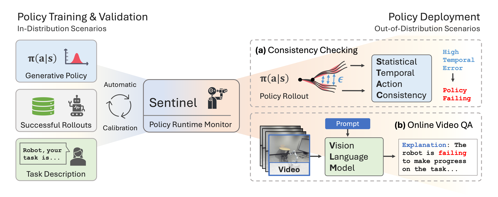

# [Sentinel] Unpacking Failure Modes of Generative Policies: Runtime Monitoring of Consistency and Progress

[Christopher Agia](https://www.chrisagia.com/)<sup>1</sup>,
[Rohan Sinha](https://rohansinha.nl/)<sup>1</sup>,
[Jingyun Yang](https://yjy0625.github.io/)<sup>1</sup>,
[Zi-ang Cao](https://scholar.google.com/citations?user=TkiMCGoAAAAJ&hl=en)<sup>1</sup>,
[Rika Antonova](https://contactrika.github.io/)<sup>1</sup>,
[Marco Pavone](https://profiles.stanford.edu/marco-pavone)<sup>1,2</sup>,
[Jeannette Bohg](https://web.stanford.edu/~bohg/)<sup>1</sup>

<sup>1</sup>Stanford University,
<sup>2</sup>NVIDIA Research


<a href='https://sites.google.com/stanford.edu/sentinel'></a> <a href='https://arxiv.org/abs/2410.04640'></a> [](https://youtu.be/rmufD7VMivc)

The official code repository for *"Unpacking Failure Modes of Generative Policies: Runtime Monitoring of Consistency and Progress,"* presented at CoRL 2024. 
For a brief overview of our work, please refer to our [project page](https://sites.google.com/stanford.edu/sentinel).
Further details can be found in our paper available on [arXiv](https://arxiv.org/abs/2410.04640).




## Overview 🗺️

This repository implements failure detection for generative robot policies in two stages: 
1. 🏗️ [Generating offline datasets](#generating-custom-datasets-️) of generative policy rollouts.
2. 📊 [Evaluating failure detectors](#evaluate-failure-detectors-) on these offline datasets. 

**Important note:** The first stage is optional, as we release (for download) the datasets associated with our published results (see [Download Datasets](#download-datasets-)), on which existing failure detectors can be evaluated and new failure detectors can be developed. However, if you would like to generate your own custom datasets, we also release an official set of [diffusion policy](https://github.com/real-stanford/diffusion_policy) checkpoints for each simulation environment we study (see [Download Policies](#download-policies-)). Lastly, we note that this repository does not support policy training; we refer to the [EquiBot](https://github.com/yjy0625/equibot/tree/main) project for training.

#### What's included? 🗂️❓
- The implementation of the Sentinel runtime monitor and a suite of failure detection baselines.
- Three simulated mobile manipulation environments: Box Closing, Object Covering, Cloth Folding (+ PushT).
- Dataset generation and evaluation scripts to accompany the above algorithms and environments.

**SLURM**: Most of our launch (`.sh`) scripts support parallelization on a cluster managed by SLURM, but will otherwise default to sequentially processing jobs.

## Getting Started 🏁
This repository is tested on Ubuntu 20.04 with Python 3.10.13.

### Installation 🛠️
Python packages are primarily managed through Poetry. Follow the installation procedure below to get setup:
```bash
# Install pyenv.
curl https://pyenv.run | bash 
exec $SHELL           # Restart shell for path changes to take effect.
pyenv install 3.10.13 # Install Python version.

# Clone repository.
git clone https://github.com/agiachris/sentinel.git
cd sentinel

# Install Poetry: see https://python-poetry.org/docs/#installation
# Install dependencies and activate virtual environment.
poetry install
poetry shell

# Install extra pip dependencies.
pip install -r requirements.txt

# Install PyTorch3D prebuilt wheel: see https://github.com/facebookresearch/pytorch3d/blob/main/INSTALL.md
# E.g., for Python 3.10, CUDA 11.8, PyTorch 2.0.0 
pip install --no-index --no-cache-dir pytorch3d -f https://dl.fbaipublicfiles.com/pytorch3d/packaging/wheels/py310_cu118_pyt200/download.html
```
Use `poetry shell` to activate the virtual environment in the current shell.


## Reproducing Simulation Results 🖥️

### Download Datasets 📁
Run the following command to download our official evaluation datasets (requires ~319Gb of disk space):
```bash
# cd <repository_root>; requires gdown.
bash scripts/download/download_datasets.sh
```
Modify `download_datasets.sh` as needed to download only a subset of the datasets.

<details>
<summary>Dataset Details</summary>

**Dataset location**: Dataset directories will be unzipped to `./logs/bc/eval` and `./logs/bc/real_eval`.

**Included results**: These dataset directories will also contain the official results under subdirectory `<date>_results_calib_on_light_1`. See [Visualizing Results](#visualizing-results) for result visualization scripts.

**Dataset conventions**: All failure detection methods are evaluated on datasets that contain both successful and failed task executions. The failure rate of the policy depends on the amount of distribution shift present in the environment _w.r.t._ the policy's training data. We generate multiple datasets per task to elicit different failure rates and failure modes from the policy. The following naming convention is used to label our datasets:
- `ca`: In-distribution, calibration dataset used to calibrate failure detectors.
- `na`: In-distribution, test dataset used to evaluate failure detectors.
- `hh`: Out-of-distribution, test dataset containing erratic (temporally inconsistent) policy failures.
- `ss`: Out-of-distribution, test dataset containing task progression (temporally consistent) policy failures. 
</details>


### Evaluate Failure Detectors 📊
Run the following sequence commands to evaluate all failure detectors over the official datasets:
```bash
# PushT environment data.
bash scripts/eval_detector/evaluate_ood_detectors_pusht.sh
# Simulated mobile manipulation environments data.
bash scripts/eval_detector/evaluate_ood_detectors_mobile.sh
# Real-world mobile manipulation environment data.
bash scripts/eval_detector/evaluate_ood_detectors_real.sh
```
Modify `evaluate_ood_detectors_<env>.sh` as needed to evaluate only a subset of the failure detectors.

<details>
<summary>Evaluation Details</summary>

**Settings**: Result directories are created based on the `date` parameter in `evaluate_ood_detectors_<env>.sh`. Adjust it from `date=<enter_date>` to the current date before running evaluation. 

**VLMs**: Evaluating VLM runtime monitors (`evaluate_vlm=1`) requires certain environment variables to be set. Please add the following to your `~/.bashrc`:
```bash
export OPENAI_API_KEY=...       # If evaluating GPT.
export ANTHROPIC_API_KEY=...    # If evaluating Claude.
export GOOGLE_API_KEY=...       # If evaluating Gemini.
```
</details>

#### Visualizing Results
Notebooks for rendering figures/plots of failure detection results can be found in [`./notebooks/final_results`](https://github.com/agiachris/sentinel/tree/main/notebooks/final_results). 


## Generating Custom Datasets 🏗️

### Download Policies 🦾
Run the following command to download our official diffusion policy checkpoints (requires ~82Gb of disk space):
```bash
# cd <repository_root>; requires gdown.
bash scripts/download/download_checkpoints.sh
```
Modify `download_checkpoints.sh` as needed to download only a subset of the policy checkpoints. Policy checkpoints will be unzipped to `./logs/bc/train`.


### Generate Datasets 📂
Run the following sequence commands to generate datasets of policy rollouts:
```bash
# PushT environment.
bash scripts/data_generation/compute_rollout_actions_pusht.sh
# Simulated mobile manipulation environments.
bash scripts/data_generation/compute_rollout_actions_mobile.sh
# Real-world mobile manipulation environment.
bash scripts/data_generation/compute_rollout_actions_real.sh
```
Modify `compute_rollout_actions_<env>.sh` as needed to create new distribution shifts, store specific policy rollout data, and control other policy rollout settings (e.g., policy execution horizon).

<details>
<summary>Dataset Generation Details</summary>

**Settings**: Datasets directories are created based on the `date` parameter in `compute_rollout_actions_<env>.sh`. Adjust it from `date=<enter_date>` to the current date before running dataset generation. 

**Downstream evaluation**: Failure detection methods can only be evaluated (as per [Evaluate Failure Detectors](#evaluate-failure-detectors-)) on datasets that have been specifically generated to support their operation (i.e., pre-computing and storing the necessary tensors). Before running a given `compute_rollout_actions_<env>.sh` script, please read its corresponding `evaluate_ood_detectors_<env>.sh` script.

</details>


---
## Citation 🏷️
Sentinel is offered under the [MIT License](https://github.com/agiachris/sentinel/blob/main/LICENSE) agreement. 
If you find Sentinel useful, please consider citing our work:
```
@inproceedings{AgiaSinhaEtAl2024,
    title     = {Unpacking Failure Modes of Generative Policies: Runtime Monitoring of Consistency and Progress},
    author    = {Agia, Christopher and Sinha, Rohan and Yang, Jingyun and Cao, Zi-ang and Antonova, Rika and Pavone, Marco and Bohg, Jeannette},
    year      = {2024},
    booktitle = {8th Annual Conference on Robot Learning}
}
```

#### Acknowledgement 🙏
The simulation environments and generative policies used in this project were adapted from [EquiBot](https://github.com/yjy0625/equibot).